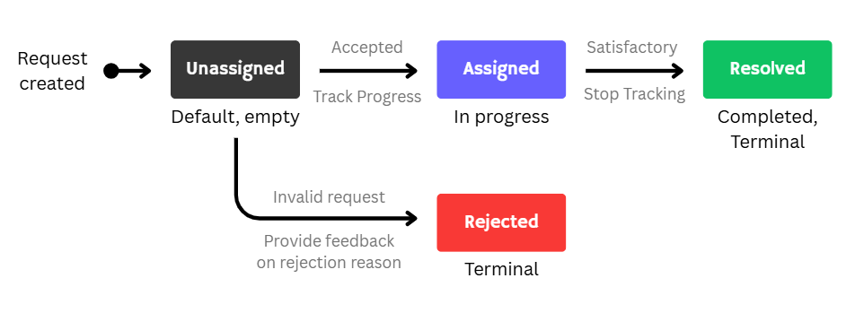
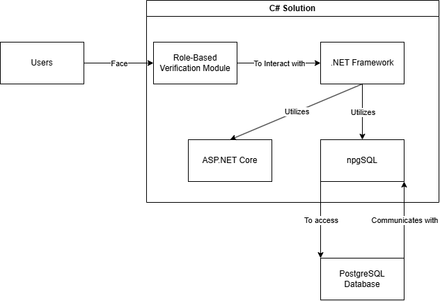
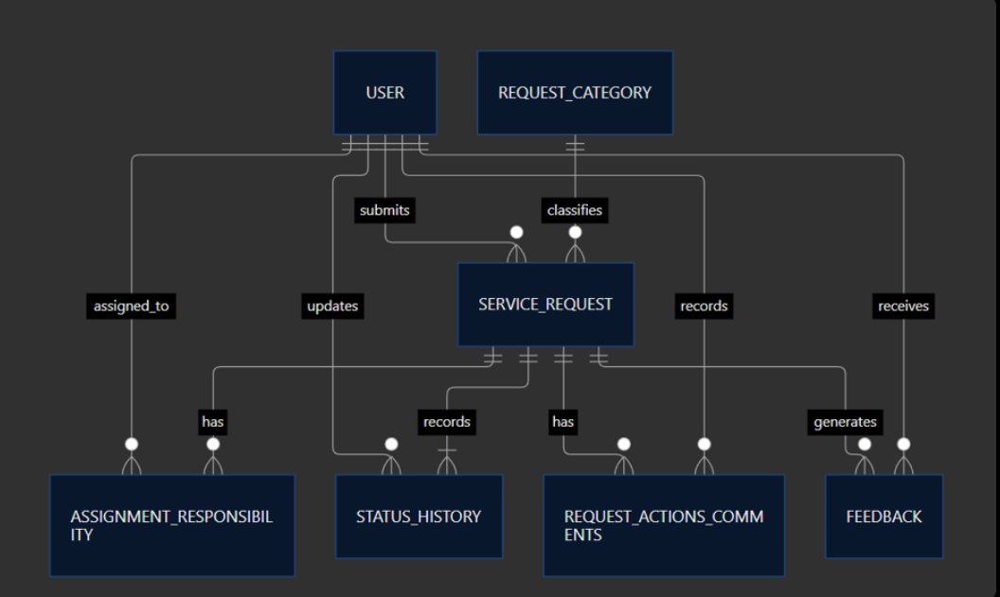

# 1. Project Engineering Document

> CivicConnect Public Service Reporting Platform
> **SEN381** *Integrated Team Project*

**Contributors:**

* Kasper van Niekerk (602622)
* Aidan Lakmeeharan (602899)
* Lethebe Kutloano (601712)

## 1.1. Contents

- [1. Project Engineering Document](#1-project-engineering-document)
  - [1.1. Contents](#11-contents)
  - [1.2. Change Control](#12-change-control)
  - [1.3. Executive Summary \& System Context](#13-executive-summary--system-context)
    - [1.3.1. System Context \& Problem Domain](#131-system-context--problem-domain)
  - [1.4. Business \& System Objectives](#14-business--system-objectives)
  - [1.5. Requirements Baseline (Functional \& Non-Functional)](#15-requirements-baseline-functional--non-functional)
    - [1.5.1. Functional Requirements](#151-functional-requirements)
    - [1.5.2. Non-Functional Requirements](#152-non-functional-requirements)
    - [1.5.3. Requirements Traceability Matrix (Initial)](#153-requirements-traceability-matrix-initial)
  - [1.6. Project Scope, Boundaries \& Constraints](#16-project-scope-boundaries--constraints)
    - [1.6.1. In Scope](#161-in-scope)
    - [1.6.2. Out of Scope](#162-out-of-scope)
    - [1.6.3. Deferred](#163-deferred)
    - [1.6.4. Scope Acceptance Rules](#164-scope-acceptance-rules)
    - [1.6.5. Project Constraints](#165-project-constraints)
    - [1.6.6. System Constraints](#166-system-constraints)
  - [1.7. Stakeholder Identification \& Governance](#17-stakeholder-identification--governance)
  - [1.8. Team Working Agreement](#18-team-working-agreement)
  - [1.9. Forward Engineering Considerations (FEC)](#19-forward-engineering-considerations-fec)
    - [1.9.1. FEC-01: Traceability](#191-fec-01-traceability)
    - [1.9.2. FEC-02: Maintainability](#192-fec-02-maintainability)
    - [1.9.3. FEC-03: Testability](#193-fec-03-testability)
    - [1.9.4. FEC-04: Security \& Data Privacy](#194-fec-04-security--data-privacy)
    - [1.9.5. FEC-05: Handoff](#195-fec-05-handoff)
  - [1.10. Risk Identification and Management](#110-risk-identification-and-management)
  - [1.11. Baseline Sign-Off \& Gate Evidence](#111-baseline-sign-off--gate-evidence)
  - [1.12. System Architecture \& Design](#112-system-architecture--design)
  - [1.13. Implementation \& Verification](#113-implementation--verification)
  - [1.14. Deployment, Operations \& SRE](#114-deployment-operations--sre)
  - [1.15. References \& Evidence Traceability](#115-references--evidence-traceability)

---

## 1.2. Change Control

| **Version** | **Date** | **Last Edit** | **By** | **Reviewers** |
|---|---|---|---|---|
| 0.0.1 | 2026/09/08 | Document structure | Kasper | Aidan, Lethebe |
| 0.1.0 | 2026/09/08 | Convert to .md | Kasper | Aidan, Lethebe |
| 0.2.0 | 2026/09/09 | Consolidated PED_1, PED_2 and Member One's requirements/scope work into a single controlled document; corrected duplicate/malformed requirement IDs; added missing FR-015; updated NFR-003 to 99.9% availability target | Kasper | Aidan, Lethebe |
| 0.3.0 | 2026/09/09 | Appended AI Usage Register (from `docs/AI_USAGE_1.md`) and Engineering Decision Log (from `docs/decisions/ENG_DECISION_LOG.md`) as controlled PED sections; renumbered downstream sections | Kasper | Aidan, Lethebe |
| 0.4.0 | 2026/09/09 | Added Team Working Agreement (draft) and Baseline Sign-Off & Gate Evidence (draft, per Master Brief Appendix D) as controlled PED sections; renumbered downstream sections | Kasper | Aidan, Lethebe |
| 0.5.0 | 2026/09/09 | Reconciled repository PED.md (which had reverted to uncorrected content) against this corrected/consolidated version; added dedicated Project Constraints subsection (§1.6.5) with cost/quality/security trade-off; finalised Team Working Agreement roles and communication plan | Kasper | Aidan, Lethebe |
| 1.0.0 | 2026/09/09 | Formal Milestone 1 Baseline Submission | Team | Aidan, Lethebe |
| 2.0.0 | 2026/09/30 | M2 controlled update: ADR-05 authorization/visibility decision, affected RTM evidence, initial Core implementation and 29 passing tests | Team | Pending M2 review |

---

## 1.3. Executive Summary & System Context

The CivicConnect platform is a digital service request management system engineered to solve operational inefficiencies in community service reporting. Currently, service issues (e.g., municipal faults, facility damage, security concerns, and IT support) are handled through decentralized channels including WhatsApp, email, paper logs, and phone calls. This project establishes a centralized, auditable, and traceable platform that connects Requesters, Operational Staff, and Management.

Milestone 1 establishes the controlled engineering foundation, baselining functional and non-functional requirements, scope boundaries, stakeholder governance, and risk mitigation strategies under strict configuration control.

### 1.3.1. System Context & Problem Domain

* **Current Operational Deficiencies:**
  * *Duplication & Loss:* Requests submitted across informal channels are frequently lost, duplicated, or misassigned.
  * *Lack of Visibility:* Citizens have zero visibility into ticket progress, status transitions, or resolution timelines.
  * *Weak Accountability:* No formal audit record exists to track staff actions, ownership changes, or management oversight.
* **Proposed Solution Boundaries:** CivicConnect provides a unified platform for service requests; from initial categorization and assignment to controlled status updates and final closure.

---

## 1.4. Business & System Objectives

The business needs a digital platform that will allow service requests to be submitted, managed, monitored and reported in a much more reliable manner. The digital platform, CivicConnect, is intended to streamline the service request process for the business and improve operational efficiency; this is the intended value the system will provide for the business. It will act as a centralized control system for service requests.

Regarding the need for the system within the business, CivicConnect will strengthen and increase the reliability of service request operations, staff and management/oversight capabilities. Service requesters will have better visibility regarding the current state of submitted requests and be able to view a history of submitted requests; they will receive feedback regarding the state of their service request and be able to categorise a request using the controlled category mechanism feature. Staff will be able to sort and search for requests and view full request details, be able to assign or accept responsibility for a request, update request status and resolve those requests when authorised.

Management will be able to view service activity information, be given reliable information about requests in order to identify whether they are open, overdue, resolved or closed, and use the available information to support accountability and service lifecycle analysis.

**Intended business value:**

- Reduced risk of requests being duplicated, overlooked or lost
- Improved visibility of request status for service requesters
- Clear communicated responsibility and ownership for staff members
- Greater accountability
- More reliable information for management regarding state of work
- Improved protection of sensitive request information
- Streamlined service request lifecycle process

---

## 1.5. Requirements Baseline (Functional & Non-Functional)

### 1.5.1. Functional Requirements

| Requirement ID | Source | Description | Priority | Status | Acceptance criteria |
|---|---|---|---|---|---|
| FR-001 | System (role-based access, all stakeholders) | The system shall allow authorised requester to perform authorised functions, according to their role | MUST | Proposed | A requester can only see their requests and not others. Staff can only access features they are permitted. Management features are unavailable to requesters and staff |
| FR-002 | Requester | The system must allow authenticated requester to submit requests | MUST | Proposed | Submission form captures necessary service request details. When correct input is entered and submit is clicked, the system stores the service request linked to the requester |
| FR-003 | Requester | The system shall allow a requester to categorise a request | MUST | Proposed | The selected category is stored in correlation to the submitted service request |
| FR-004 | Requester | The system shall allow a requester to view status of their submitted requests | MUST | Proposed | The request status displays current status |
| FR-005 | Requester | The system shall allow requesters to view a history/list of their previously submitted requests | MUST | Proposed | The list shows service requests submitted by the requester and the relevant information. When no requests exist, an empty screen/history list is returned |
| FR-006 | Staff | The system shall allow authorised staff to search, filter and sort service requests | MUST | Proposed | Staff can search using matching data such as unique identifier for service request. Staff can filter by categories. Staff can sort by categories |
| FR-007 | Requester | The system shall provide meaningful feedback regarding the state of a request | MUST | Proposed | Each application feedback displays the relevant service request along with its status and reasoning for the status given |
| FR-008 | Staff | The system shall allow authorised staff to view full request details | MUST | Proposed | The system provides full service request details. A staff cannot view a request if they are not authorised for the request |
| FR-009 | Staff | The system shall allow an authorised staff to assign or accept responsibility for a request | MUST | Proposed | Responsibility is given by selecting another staff role. No other role but staff can assign/accept responsibility for a request |
| FR-010 | Staff | The system shall record material actions and comments associated with a request | MUST | Proposed | Comments will be saved as an entry with the author and description of the comment. Empty comments are rejected |
| FR-011 | Staff | The system shall allow authorised staff to resolve/close requests | MUST | Proposed | After a service has been resolved, the requester will be able to see the new status. Only a request in an approved state can be closed |
| FR-012 | Management | The system shall allow authorised managers to view service activity information | MUST | Proposed | The overview does not expose request information outside the manager's authorised scope |
| FR-013 | Management | The system shall allow management to identify open, overdue, resolved, and closed requests | MUST | Proposed | System provides managers with counts of open, overdue, resolved, closed requests |
| FR-014 | Management | The system shall allow management to view request information according to filters such as category/status | MUST | Proposed | System provides filter options for managers to select from |
| FR-015 | Staff | The system shall allow authorised staff to update a request through defined status transitions | MUST | Proposed | The system will only accept the following: Assigned, In Progress, Resolved, Closed |

### 1.5.2. Non-Functional Requirements

| Requirement ID | Source | Category | Description | Priority | Status | Verification |
|---|---|---|---|---|---|---|
| NFR-001 | Project Master Brief/projectmanagement.com | Performance | The system shall respond as intended during normal operational conditions | MUST | Proposed | Measured via load test |
| NFR-002 | Project Master Brief/projectmanagement.com | Security | The system should use HTTPS and use hashing to store passwords | MUST | Proposed | Inspect authentication configuration, pass when HTTPS is enforced and no plaintext passwords stored |
| NFR-003 | Project Master Brief/projectmanagement.com | Availability | The system must be able to achieve 99.9% availability | SHOULD | Proposed | Availability measurement |
| NFR-004 | Project Master Brief/projectmanagement.com | Reliability | A service request lifecycle will either save all request details or not when an error occurs during an assignment or status update, the database contains either the changed and completed result or the unchanged result | SHOULD | Proposed | Fault testing |
| NFR-005 | Project Master Brief/projectmanagement.com | Access control | The system shall prevent unauthorised and unauthenticated users from accessing service request information | MUST | Proposed | Security tests which confirm that protected endpoints reject unauthenticated users |
| NFR-006 | Project Master Brief/projectmanagement.com | Compatibility | The system shall operate on the latest stable versions available to the team | SHOULD | Proposed | Cross-browser testing |
| NFR-007 | Project Master Brief/projectmanagement.com | Data privacy | The system shall prevent requesters from viewing other requests that don't belong to them unless authorised | MUST | Proposed | Using two requester accounts and try to access other account's requests |
| NFR-008 | Project Master Brief/projectmanagement.com | Usability | Users should be allowed to complete service request functions without requiring any assistance | SHOULD | Proposed | Tested via completion rate and time taken to complete the service request process |

### 1.5.3. Requirements Traceability Matrix (Initial)

**Functional requirement traceability matrix:**

Updated Functional RTM

The quality drivers used are the following: D1 integrity and audit; D2 access and privacy; D3 lifecycle visibility and reporting; D4 availability; D5 normal-load response.

| Requirement ID | Stakeholder and Priority | Acceptance criteria                                                                                                                                                    | ASR/ Quality driver | Architecture / module / component               | Data / persistence impact                    | Design/ interface decision                                  | Technology decision                        | Implementation evidence | Verification evidence                                            | Status                                    | ADR / Change / risk reference      |
|----------------|--------------------------|------------------------------------------------------------------------------------------------------------------------------------------------------------------------|---------------------|-------------------------------------------------|----------------------------------------------|-------------------------------------------------------------|--------------------------------------------|-------------------------|------------------------------------------------------------------|-------------------------------------------|------------------------------------|
| FR-001 | System (role-based access, all stakeholders) | The system shall allow authorised requester to perform authorised functions, according to their role | MUST | In Development | Requester scope is owner-only; Staff scope is the union of permitted Staff-group request types; Management has broader authorised scope | D2 | Authorization policy / request visibility | UserAccount / Role / StaffGroup (persistence pending) | Visibility policy + lifecycle authorization seam | ASP.NET Core authorization at application boundary (planned); Core authorization policy implemented | `src/CivicConnect.Core/Authorization/` and updated `Lifecycle/TransitionService.cs` | 29 Core tests passing, including authorization tests | ADR-05; RISK-001; RISK-M2-04 |
| FR-002         | Requester, MUST          | submit is clicked, the system stores the service request linked to the requester                                                                                       | D1, D2              | Request service                                 | Service Request                              | Transactional create; validate before commit                | PostgreSQL proposed and runtime pending    | Planned                 | Tests for valid and invalid submission                           | M1 approved; M2 proposed; not implemented | DEC-M2-01,DEC-M2-03                |
| FR-003         | Requester, MUST          | The selected category is stored in correlation to the submitted service request                                                                                        | D1, D3              | Category and request service                    | RequestCategory                              | Controlled category selection/validation                    | PostgreSQL proposed                        | Planned                 | Test for stored-data check regarding category selection          | M1 approved; M2 proposed; not implemented | DEC-M2-01                          |
| FR-004 | Requester | The system shall allow a requester to view status of their submitted requests | MUST | In Development | A requester may view status only for requests within their owner scope | D2, D3 | Request visibility policy | ServiceRequest ownership | Owner-scoped visibility | PostgreSQL proposed; application authorization implemented in Core | `src/CivicConnect.Core/Authorization/` | Authorization tests passing; repository/API integration planned | ADR-05; RISK-M2-04 |
| FR-005 | Requester | The system shall allow requesters to view a history/list of their previously submitted requests | MUST | In Development | Request history is limited to the requester's own scope | D2, D3 | Request visibility scope | ServiceRequest ownership | Owner-scoped list query (repository integration pending) | PostgreSQL proposed | `VisibilityScope` implemented; repository/API query integration deferred | Initial policy tests passing; query integration planned | ADR-05; FEC-03 |
| FR-006 | Staff | The system shall allow authorised staff to search, filter and sort service requests | MUST | In Development | Staff can only search/filter/sort requests within the union of request types permitted by their Staff groups | D3, D5 | Staff visibility scope + query filtering | RequestCategory / StaffGroup mapping (persistence pending) | Scoped filtering and sorting | PostgreSQL proposed | `VisibilityScope` and StaffGroup policy implemented in Core; query integration planned | Authorization tests passing; repository/API integration planned | ADR-05; RISK-M2-04 |
| FR-007         | Requester, MUST          | Feedback contains request, status and reasoning                                                                                                                        | D1, D3              | Feedback information                            | Request query and feedback view              | No external notification, In-app information viewing        | PostgreSQL proposed and UI pending         | Planned                 | Tests for status feedback and mandatory rejection reason         | M1 approved; M2 proposed; not implemented | Clarification required; RISK-M2-05 |
| FR-008 | Staff | The system shall allow authorised staff to view full request details | MUST | In Development | A Staff member cannot view a request outside the request types permitted by their groups | D2 | Request-level visibility policy | ServiceRequest + RequestCategory + StaffGroup (persistence pending) | Same visibility policy used for individual access and list scope | ASP.NET Core authorization planned at application boundary | `src/CivicConnect.Core/Authorization/` | Authorization tests passing; API integration planned | ADR-05; RISK-001; RISK-M2-04 |
| FR-009         | Staff, MUST              | Staff-only assignment/acceptance                                                                                                                                       | D1, D2              | Assignment/ acceptance commands                 | AssignmentResponsibility                     | Staff scope check and closing of previous active assignment | PostgreSQL proposed                        | Planned                 | Authorisation tests for assignment and acceptance                | M1 approved; M2 proposed; not implemented | DEC-M2-03; RISK-M2-03              |
| FR-010         | Staff, MUST              | Comments will be saved as an entry with the author and description of the comment                                                                                      | D1                  | Request event service                           | RequestActionComment                         | Append attributed, non-empty comment                        | PostgreSQL proposed                        | Planned                 | Tests covering recordings and recorded actions                   | M1 approved; M2 proposed; not implemented | DEC-M2-01,DEC-M2-03; RISK-M2-03    |
| FR-011         | Staff, MUST              | Requester sees resolved status; only approved state closes                                                                                                             | D1, D3              | Request lifecycle query                         | Current status and Status History            | Proposed RESOLVED→CLOSED, pending approved-state            | PostgreSQL proposed                        | Planned                 | Tests to resolve and close service requests                      | M1 approved; M2 proposed; not implemented | DEC-M2-03; RISK-M2-05              |
| FR-012 | Management | The system shall allow authorised managers to view service activity information | MUST | In Development | Manager view is limited to the manager's authorised reporting scope; current Core policy provides the broader Manager scope, with reporting query integration deferred | D2, D3 | Manager visibility scope | ManagementReportingView / ServiceRequest | Manager-scoped reporting query | PostgreSQL proposed | `RoleVisibilityPolicy` provides Manager scope in Core; reporting/API integration planned | Authorization tests passing; reporting integration planned | ADR-05; RISK-M2-04 |
| FR-013 | Management | The system shall allow management to identify open, overdue, resolved, and closed requests | MUST | In Development | Counts must be calculated only from the manager's authorised reporting scope | D3 | Manager-scoped reporting | ServiceRequest | Manager-scoped count query | PostgreSQL proposed | Authorization scope implemented; reporting query pending | Planned | ADR-05 |
| FR-014 | Management | The system shall allow management to view request information according to filters such as category/status | MUST | In Development | Manager filters operate within the manager's authorised scope | D2, D3 | Manager visibility + filtered reporting | ServiceRequest / RequestCategory | Manager-scoped filtered query | PostgreSQL proposed | Authorization scope implemented; reporting query pending | Planned | ADR-05 |
| FR-015         | Staff, MUST              | Only accepts Assigned, In Progress, Resolved, Closed                                                                                                                   | D1                  | RequestCommandService                           | ServiceRequest – current Status              | Explicit transition policy                                  | PostgreSQL proposed                        | Planned                 | Tests for valid/invalid status-transition enforcement            | M1 approved; M2 proposed; not implemented | DEC-M2-03; RISK-M2-03 / RISK-M2-05 |

**Non-functional requirement traceability matrix:**

| Requirement ID | Stakeholder and Priority | Acceptance criteria                                              | ASR/ Quality driver | Architecture / module / component | Data / persistence impact                                                               | Design/ interface decision    | Technology decision                                                    | Implementation evidence | Verification evidence                      | Status                                    | ADR / Change / risk reference              |
|----------------|--------------------------|------------------------------------------------------------------|---------------------|-----------------------------------|-----------------------------------------------------------------------------------------|-------------------------------|------------------------------------------------------------------------|-------------------------|--------------------------------------------|-------------------------------------------|--------------------------------------------|
| NFR-001        | M1 PED/ MUST             | Measured via load test                                           | D5                  | Query performance                 | Measure reporting queries as history grows.                                             | Bounded query size            | PostgreSQL                                                             | Planned                 | load test results after threshold approved | M1 approved; M2 proposed; not implemented | DEC-M2-01; RISK-003                        |
| NFR-002        | M1 PED/ MUST             | HTTPS enforced; no plaintext passwords                           | D2                  | Identity and deployment           | Store has passwords only                                                                | Credential handling           | Secure password storage such as bcrypt. TLS config for HTTPS enforcing | Planned                 | HTTPS config and stored-hash analysis      | M1 approved; M2 proposed; not implemented | RISK-001; stack ADR pending                |
| NFR-003        | M1 PED/ SHOULD           | Monitoring testing and maintenance logs                          | D4                  | Category and require services     | Single database failure interrupts system workflows. Backups/restores must be available | Document recovery             | PostgreSQL and recovery plans proposed                                 | Planned                 | monitoring and maintenance logs            | M1 approved; M2 proposed; not implemented | RISK-004 / RISK-M2-01; scope clarification |
| NFR-004        | M1 PED/ SHOULD           | Fault testing                                                    | D1                  | Request command services          | ServiceRequest, Status History, AssignmentResponsibility                                | Transaction and version check | PostgreSQL proposed transactions                                       | Planned                 | Concurrent update testing                  | M1 approved; M2 proposed; not implemented | DEC-M2-03; RISK-M2-03                      |
| NFR-005 | M1 PED MUST | Authorisation security tests | D2 | Authorization policy / request visibility | Request queries must apply authorised role and ownership/group scope before returning rows | Server-side checks; single policy for list and item access | ASP.NET Core authorization planned at application boundary; Core visibility policy implemented | `src/CivicConnect.Core/Authorization/` | 29 Core tests passing; endpoint/query security tests planned when API exists | In Development | ADR-05; RISK-001; RISK-M2-04 |
| NFR-006        | M1 PED/ SHOULD           | Access control tests                                             | D2                  | User interface                    | N/A                                                                                     | Compatible UI                 | Browser/front-end choice pending                                       | Planned                 | Integration and latest version tests       | M1 approved; M2 proposed; not implemented | UI/stack ADR pending                       |
| NFR-007 | M1 PED MUST | URL and API testing across two accounts | D2 | Authorization policy / request visibility | Each request is linked to its owner; Staff access is additionally constrained by group/request-type scope | Row/list scope enforced server-side | PostgreSQL ownership FK proposed; API enforcement pending | `VisibilityScope` and `RoleVisibilityPolicy` implemented in Core | 29 Core tests passing; cross-account URL/API tests planned at application boundary | In Development | ADR-05; RISK-001; RISK-M2-04 |
| NFR-008        | M1 PED/ SHOULD           | Completion rate and time taken to complete service request tests | D2                  | User interface and workdlow       | Clear status/feedback data supports task                                                | Accessible forms and feedback | Front-end stack pending                                                | Planned                 | defined usability task and timed study     | M1 approved; M2 proposed; not implemented | UI/design ADR pending                      |

---

## 1.6. Project Scope, Boundaries & Constraints

The scope of CivicConnect is to provide a digital platform that the business will use to submit, manage and report on service requests in a more reliable manner. It prioritises the reliable management and traceability of service requests over other features. The scope is needed to ensure that stakeholder needs remain achievable within project constraints and to provide enough detail to guide team members through the project lifecycle.

### 1.6.1. In Scope

**Requester capabilities:**
- Submitting a new request with appropriate information
- Ability to categorise a request
- Viewing the status of submitted requests
- Viewing history of submitted requests
- Receive feedback regarding request status (accepted, rejected, updated or completed)
- Viewing only request information that the requester has access to

**Staff capabilities:**
- Viewing service requests relevant to the authorised staff
- Searching, filtering or sorting actions on requests
- Viewing full request details
- Assigning or accepting responsibility for a request
- Ability to update request status
- Recording relevant information, actions or comments
- Resolving or closing requests where authorised

**Management and oversight capabilities:**
- Viewing service activity information
- Identify requests according to states (open, overdue, resolved, and closed)
- Viewing request information by selected filters: category and status
- Accessing enough information to support accountability and service-performance analysis

**System capabilities:**
- User access and authorization based on roles and responsibilities
- Validation of service request input
- Storage of request details, ownership, status and lifecycle history
- Protection of sensitive information
- Show each requester their own request list, current status and feedback

### 1.6.2. Out of Scope

- Creation of a Native Android or iOS mobile application
- Importing of requests from external platforms/systems such as WhatsApp, email, telephone systems, etc.
- Payment functions/financial transactions
- Inventory control, asset management functions of the service requests
- Functionality unrelated to service-request lifecycle
- Purchase or installation of hardware
- Failure recovery. CivicConnect is responsible for ensuring reliable delivery of the service request lifecycle; it will not perform any maintenance should a failure occur.

### 1.6.3. Deferred

- Integration with existing external systems
- Notification system regarding the state of service request
- Requester satisfaction, making use of feedback services for evaluations
- Exporting reports to text-document formats
- Automatic escalation of overdue service requests
- Configurable management dashboards

**Deliberate exclusion:** Importing from WhatsApp, Email, telephone systems, etc.

Focus will be purely emphasized upon the service request lifecycle. Having importing from WhatsApp, email, and other platforms might introduce integration complexity and additional testing, shifting the focus from the core feature expressed to ensuring that the importing works. Whilst the importing will remove manual data capture, it still is an uncertainty to include within the system.

### 1.6.4. Scope Acceptance Rules

- In-scope, out-of-scope and deferred scope items must not contradict each other.
- Every requirement appears within the RTM.
- The team must confirm that the committed scope is feasible within the upcoming and available milestones.
- Stakeholders and team members review documentation and approvals are recorded.
- Every in-scope feature must possess a unique requirement identifier.
- Requirement and scope identifiers must remain stable across milestones.
- The team must use a change request and impact analysis before altering any scope/requirement items.
- A MUST requirement belongs to the committed baseline unless formally altered by the team.
- A SHOULD requirement may be deferred through documented impact analysis.
- A COULD requirement is optional and must not replace a MUST requirement.

### 1.6.5. Project Constraints

| Constraint | Minimum Expectation for CivicConnect | Engineering Implication |
|---|---|---|
| Team size | Exactly 3 registered students (Kasper, Aidan, Lethebe). | Individual accountability evidence (§1.8, §1.11) must be traceable per member, not only per team. |
| Schedule | Four formal milestones across the SEN381 delivery period; M1 baseline due before M2 architecture work begins. | Technology-stack and architecture decisions are deliberately deferred to M2 (DEC-M1-02, §1.12) rather than rushed now. |
| Cost | Prefer free/low-cost services; operational cost beyond the educational context must be identified. | Directly drives RISK-002 (§1.10); any paid service/technology requires a cost check and Decision Log entry before adoption. |
| Scope | Baselined scope (§1.6.1–1.6.3) is controlled; changes require impact analysis, not silent absorption. | The deliberate WhatsApp/email-import exclusion (§1.6.3) is the first tested case of this control. |
| Quality | Quality attributes must be measurable, not asserted (NFR-001–NFR-008, §1.5.2). | Claims like "the system is reliable" are insufficient without the linked test evidence required from M3 onward. |
| Security | Security is lifecycle-wide, not a final add-on. | FEC-04 (§1.9) and NFR-002/NFR-005/NFR-007 (§1.5.2) commit the team to access control, HTTPS, and data-privacy requirements from the requirements stage, before any code exists. |
| Technology | No stack is prescribed; selection must be justified against requirements, team capability, and constraints. | Formally deferred to M2 via DEC-M1-02 (§1.12), informed by the FR/NFR baseline above. |

**Interaction/trade-off worth noting:** the Cost constraint and the Quality/Security constraints pull in opposite directions — preferring free-tier services (Cost) can mean weaker built-in security or reliability guarantees (Quality, Security, RISK-001/RISK-004), so free-tier selections in M2 will need an explicit check against NFR-002, NFR-005 and NFR-007 rather than being chosen on price alone.

---

### 1.6.6. System Constraints

**Schedule:** The schedule of the project follows four milestones, one of which is the submission of this section. The final milestone will be submitted by the 18th of October.

**Cost:** The project should have minimal costs, that do not financially burden the community or business. Free software should be used where possible.

**Scope:** Functional requirements outlined earlier in the document need to be adhered to, non-functional requirements can be deferred to another time if necessary. Costs need to be respected, the project must be completed on time, along with all quality requirements being met.

**Quality:** The project needs to be functional, reliable, stable, usable by the majority of participants, and allow for potential improvements.

**Security:** Data needs to be kept secure, backed up, relevant and reliable. Should there be any data risks, systems such as backups need to be kept up to date.

---

## 1.7. Stakeholder Identification & Governance

**Stakeholders:**

**Staff:** Reporting staff working with CivicConnect have a stake in the project as they are the ones who are going to be using the system. Their interests and feedback will have significant contributions to the project with regards to its user interface, accessibility, as well as the product testing.

**Contractors:** Any service requests, requirements, payments and communications for contractors go through CivicConnect. As such, any potential contractor would have a stake in the project. However, it would be difficult to consult with potential contractors as they can change with each project and dependent on their tenders. They will therefore be considered, however are not significant stakeholders in the project.

**Communal Users:** The community that uses CivicConnect will want to understand how the software works, and their input for the development of CivicConnect will be required to allow for a functional and satisfactory product upon completion.

**Business and Financial Stakeholders:** The business, as well as its and any other financial backers, will want to ensure that they get value out of the product they are investing in, as well as a return on their investment. As such they have a significant stake and interest in a successful outcome of the project.

**Additional parties of interest:**

**Government Regulatory Bodies:** Regulatory Bodies would want to ensure that CivicConnect complies with code requirements and regulations. As such, the development team needs to ensure that any potential regulatory requirements are analysed and adhered to within the project scope.

**SARS:** The South African Revenue Service will want financial reports with respect to the project, as well as potential information relating to audits. This is both to ensure lawful compliance, as well as required taxes that can arise from the product's potential profits or losses.

---

## 1.8. Team Working Agreement

**Team members:** Kasper van Niekerk (602622), Aidan Lakmeeharan (602899), Lethebe Kutloano (601712)

**Purpose:** This agreement records how the team will collaborate, communicate, take decisions and hold each other accountable across the CivicConnect project, in line with Master Project Brief §8 (Team Engineering and Individual Accountability).

**Collaboration & communication**
- Primary communication channel: team WhatsApp group for day-to-day coordination; formal decisions and substantive discussion recorded via GitHub Issues/PRs, not left only in chat.
- Standing check-in cadence: weekly sync ahead of each milestone deadline, plus ad hoc check-ins as needed.
- All substantive engineering discussion and decisions that affect the baseline must be reflected in a controlled artefact (Decision Log, PR, or issue); not left only in chat.

**Roles (may be adjusted per milestone, but do not remove collective responsibility per §8)**
- Requirements & Documentation Lead — Kasper
- Architecture/Backend Lead — Aidan
- Quality & Risk Lead — Lethebe
- Roles rotate or share workload as needed; every member remains individually responsible for understanding the complete project per Master Brief §8.

**Decision-making**
- Minor/technical decisions within an individual's assigned area may proceed without full team sign-off, but must be logged in the Decision Log.
- Decisions affecting baselined scope, requirements, architecture or shared infrastructure require agreement from all three members before being actioned.
- Disagreements that cannot be resolved within the team will be raised with the lecturer rather than left unresolved.

**GitHub & review conduct**
- Every substantive change to controlled artefacts (documentation or code) goes through a Pull Request; no direct commits to `main`.
- Minimum of two approvals from members other than the author, per Master Brief §9. Self-approval is not accepted.
- Reviewers are expected to leave meaningful comments (see Master Brief §9.1), not rubber-stamp approvals.

**Accountability & conduct**
- Each member commits to producing the minimum individual evidence required by Master Brief §8.1 (meaningful commits, PRs authored and reviewed, contribution to decision records, ability to trace and defend at least one requirement).
- A member unable to meet a commitment must raise this with the team as early as possible, not at the deadline.
- All members are expected at every milestone presentation and individual defence per Master Brief §19; attendance is not optional and is not substitutable by another member's contribution.

**Conflict handling**
- Concerns about workload distribution or contribution imbalance will be raised directly and early within the team.
- If unresolved, the concern will be escalated to the lecturer before it affects milestone delivery.

**Agreement**

| Member | Agreed (Y/N) | Date |
|---|---|---|
| Kasper van Niekerk | Y | 2026/09/09 |
| Aidan Lakmeeharan | Y | 2026/09/09 |
| Lethebe Kutloano | Y | 2026/09/09 |

---

## 1.9. Forward Engineering Considerations (FEC)

### 1.9.1. FEC-01: Traceability

* **Planning Influence**: Facilitating tracking and auditing service requests (required for accountability) will require specific data solutions and transaction management, directly impacting technology and architecture choice.
* **Future Influence**: Data structure, storage policy, and audit log design.
* **Information Needs**: Log retention timeline, compliant audit attributes to be collected.
* **Risk If Ignored**: Poor management capabilities as requests cannot be linked to the agents that changed them, causing errors to compound as they cannot be monitored to be detected. Legal trouble when services cannot be linked to requests via audit.

### 1.9.2. FEC-02: Maintainability

* **Planning Influence**: Designing to facilitate future code changes and ease of maintenance requires modular, loosely coupled code that directly influences architecture design. It will also guide code structures and documentation requirements from the start, and so must be planned for early.
* **Future Influence**: Code structure, backend stack options, documentation, module design, coupling, API format.
* **Information Needs**: Stack choice, hand-off requirements, final software lifetime and maintenance scope.
* **Risk If Ignored**: If the team doesn't explicitly develop with maintainability in mind then systems will be tightly coupled and individual services cannot be updated. Instead time and costs increase as the ecosystem must be overhauled to suit small changes, which is unacceptable.

### 1.9.3. FEC-03: Testability

* **Planning Influence**: A testable system requires isolated components with independent functionality that can be separately verified so a nested failure doesn't go unnoticed and cause cascading failures. This will directly impact coding strategy and validation processes, and should be accounted for before moving to the design phase.
* **Future Influence**: Component scope and communication, verification process, test suites.
* **Information Needs**: Component granularity, service complexity, code coverage goals, and the selected testing tools/frameworks.
* **Risk If Ignored**: Even a well designed system cannot be analysed and corrected if it cannot be properly tested. Without proper testability architecture in place, errors will accumulate and undermine the functionality and reliability of the system, including security.

### 1.9.4. FEC-04: Security & Data Privacy

* **Planning Influence**: Security will directly impact the system approach to ensure role-based access is enforced at every step of the program, while data privacy similarly affects data collection and retention considerations, thereby impacting both the frontend and backend planning.
* **Future Influence**: User account management, verification, recovery strategies, encryption, backup management, role management.
* **Information Needs**: Data retention regulations, privacy regulations, required user information, variation of roles required, chosen stack encryption support.
* **Risk If Ignored**: Data loss or leak that can lead to system interruptions, failure, and legal action. Account failures leading to unauthorized actions or unrecoverable roles.

### 1.9.6. FEC-06: Role and Visibility Configuration

* **Planning Influence**: Request visibility is a dedicated authorization responsibility rather than being embedded in lifecycle logic. Requester ownership, Staff group/request-type scope and Manager scope must remain enforceable at the server-side application boundary.
* **Future Influence**: User/role persistence, StaffGroup membership, request-type/category mapping, API authorization, repository query scoping and manager administration.
* **Information Needs**: Final role/group administration model, authentication provider, persistence schema for Staff groups and request types, and exact manager reporting scope.
* **Risk If Ignored**: Authorization rules may diverge between list queries, individual-request access and lifecycle operations, creating unauthorized disclosure or inconsistent permissions.
* **Current M2 evidence**: `CivicConnect.Core/Authorization/` implements the initial policy boundary and `VisibilityScope`; lifecycle authorization now consumes that boundary. Repository/API/database integration is deferred.

### 1.9.5. FEC-05: Handoff

* **Planning Influence**: The final interface should be operable by non-technical municipal staff. Onboarding, user roles, system administration, and help documentation must be planned early so the system doesn't rely on developers for day-to-day use.
* **Future Influence**: Admin UI design, user role management, system setting controls, error messages, and admin/user documentation.
* **Information Needs**: Target admin skill level, required system settings (like ticket categories and department routing), and training documentation scope.
* **Risk If Ignored**: Non-technical staff won't be able to run the system, change settings, or onboard new agents without developer intervention. This leads to mismanaged requests, system misuse, and high maintenance overhead.

---

## 1.10. Risk Identification and Management

P: Probability (Low, Medium, High)
I: Impact (Low, Medium, High)

| Risk ID | Description | Cause | P | I | Priority | Mitigation | Contingency | Owner | Status |
|---|---|---|---|---|---|---|---|---|---|
| RISK-001 | Sensitive request/personal data is exposed, leaked, or accessed without authorisation | Insufficient access control, weak authentication, unencrypted storage/transit | M | H | High | Enforce role-based access control, encryption in transit/at rest, two-factor authentication for staff/management accounts | Revoke or rotate credentials, disable affected access, review audit records, notify stakeholders | Aidan | Open |
| RISK-002 | Project cost exceeds the team's available/educational budget | Reliance on paid technologies, subscriptions, or services not evaluated for cost before adoption | M | M | Medium | Investigate and document cost of any new technology/service before adoption; prefer free/low-cost tiers where practical | Fall back to free or self-hosted options and defer non-essential services through change control | Kasper | Open |
| RISK-003 | Delivered software fails to meet baselined quality/functional standards | Technology limitations, incomplete testing, or inconsistent individual contribution | M | H | High | Stage-gate review of each milestone's artefacts against acceptance criteria before sign-off | Defer SHOULD requirements through impact analysis rather than reducing testing | Lethebe | Open |
| RISK-004 | System is unavailable or degrades during peak usage, causing service disruption | Single central database server, latency, connectivity issues, power outages, hosting constraints | M | M | Medium | Select hosting with acceptable uptime guarantees; monitor performance; plan for redundant/backup capacity where cost allows | Restore from backup, communicate the outage, review hosting choice | Aidan | Open |
| RISK-005 | The central PostgreSQL server is a single point of failure and a network dependency; hosting cost and availability limits are unverified | Single database server; free-tier limits, backup and recovery not yet evidenced; availability on BC Desktop not confirmed | M | H | High | Verify hosting limits and BC Desktop compatibility from official sources; document backup/recovery and SPOF at architecture level in the persistence ADR | Fall back to a local instance for development and demonstration | Aidan | Open |
| RISK-006 | Delivery is compressed and PR reviews bottleneck, leading to late bulk merges or weak reviews that earn limited credit | Compressed timeline; two independent approvals required on every substantive PR (Master Brief section 9) | H | H | High | Open PRs early; reviewers named and given specific checks; keep commits progressive | Split large PRs; record schedule variance honestly | Lethebe | Open |

---

## 1.11. Baseline Sign-Off & Gate Evidence

Based on Master Project Brief Appendix D.

**Project:** CivicConnect

**Baseline type:** Milestone 1; Engineering Foundation & Requirements Baseline (PED v1.0)

**Version:** 1.0.0

**Date:** 2026-09-09

| Check | Status |
|---|---|
| Scope reviewed | YES; in-scope/out-of-scope/deferred baseline complete. |
| Requirements/traceability checked | YES; 15 FRs, 8 NFRs, and FR/NFR traceability matrices complete with consistent IDs. |
| Risk review completed | YES; initial Risk Register with 4 prioritised risks, mitigation and contingency. |
| Repository/governance controls checked | YES |

**Outcome:** ACCEPTED

**Reviewers:** Kasper, Aidan, Lethebe

---

### M2 Architecture / Design baseline update

**M2 status:** Initial authorization/visibility implementation complete; API, authentication and persistence integration deferred.

- **ADR-05:** Centralize role/request visibility in a dedicated Authorization module using a Strategy-style visibility policy that returns a `VisibilityScope`.
- **Requester:** own-request scope.
- **Staff:** scope is the union of request types permitted by all Staff groups assigned to the user.
- **Manager:** broader authorised scope; detailed reporting scope remains to be integrated at the application/query boundary.
- **Lifecycle responsibility:** lifecycle transition rules remain in `TransitionService`; authorization is separated so lifecycle code does not own role/group visibility rules.
- **Current implementation boundary:** Core/domain policy and tests are implemented; ASP.NET/API/database integration is deferred.
- **Deferred manager administration:** adding Staff accounts and managing Staff groups from a manager UI are deferred.

## 1.12. System Architecture & Design

## ASRs, Quality Drivers and Architecture decisions

The architectural decisions driving the technogoly used for CivicConnect are driven by the shareholders of the project, as well as the development team's capabilities. The requirements for the project that have been determined to be significant include Security, Accessibility, Performance, Integration of systems, Data integrity and Maintainability. Users of CivicConnect will need access to the technology used, whilst keeping data secure. The performance of the project will also need to be adequate for users to have a seemless experience. Meanwhile, the developers and management will want to ensure data is secure and the correct data is being utilized in CivicConnect. Developers will also want an easily maintainable system to both add features in the future as well as fix any defects that arise in the short-term. The developers will therefore also want a system with functional integrations, with adequate cohesion and coupling of systems for maximum functionality of CivicConnect. With this in mind, the following Technology stack has been determined to be ideal for CivicConnect:

C# Programing, ASP.NET Core, PostgreSQL Database System, with npgSQL integration\
The reason for this is the developers have experience in dealing with these systems, thereby fulfilling maintainability requirements. npgSQL also allows PostgreSQL integration with C# and .NET frameworks. Additionally C# will allow efficient programming for better performance, while providing adequate security measures that are built in to C#. Lastly, because everything is open-source and free, it is both accessible to the users and to the developers and meets the shareholder's requirements for costs.

The following stacks were also analyzed and elements of each stack can also be utilized for CivicConnect:

Python Programming, Django, with PostgreSQL/SQLite\
Java, SpringBoot, with PostgreSQL, JUnit and Maven\
Typescript, Node/Express, with PostgreSQL/Vitest/Jest, React/Server-rendered Pages

The stack will interact as per the following diagram:\

## Technology Decisions, integration and deployment compatibility

For C# programming the technology used will be Microsoft Visual Studio. The decision to do so is due to its familiarity to the developers, the integration capabilities with .Net frameworks, as well as npgSQL. Additionally, should there be a decision to switch to other programing languages at any point it is a simple transition within the software. On the backend, for the server, intially a local server will be used for Postgre SQL, however for testing purposes Google Cloud Servers can also be utilized. The technologies utilized here comform to the intial ASR guidelines, however should there be a decision to move away from the initial stack, software such as Netbeans IDE can be used for Java, while Microsoft VS Code can be utilized for Python and Node/Express. All options are compatible and have adequate integration for Postgre SQL, as well as complementary software available in their respective stacks. 

## Data and persistence baseline

- Important data entities/aggregates, relationships, ownership and lifecycle implications

| Entity/Aggregate | Relationship | Ownership | Lifecycle Implications |
| --- | --- | --- | --- |
| User | One user can submit and can own multiple requests. Staff can also be responsible for multiple requests and the processing of those requests. | Each user only has access to their content and authorised actions. | Upon account creation, user is granted access to requester permissions and their identity is established.   Account deletion results in credentials getting revoked and access role is removed, |
| ServiceRequest | Each request belongs to one user and one category. It has one current status and can contain multiple assignments. | The requester creates the requests, the authorised staff manage and process the requests | Request created after submit button is clicked and goes through a process. Status changes are recorded which contain the author, date and why the status was changed. Old requests are preserved in a history list |
| RequestCategory | One category can contain multiple requests | Requesters choose from the available categories whilst the authorised staff maintain the category list | Categories should be linked to requests. Category creation and deletion is managed by the staff. Category deletion does not remove association to existing requests. |
| Assignment responsibility | Each assignment links an authorised staff member to a request. A request can contain multiple assignments. | Authorised staff allocate the responsibility, and the assigned staff is responsible for the requests processing | Request assignment should not create conflicts with existing current ownerships over requests. Ownership can be shared or be given to one staff. |
| Status History | One request can contain multiple status changes over time. | Authorised staff control the status changes of a request | Add a history entry whenever status changes. Updating the current status and history should be done within one transaction so they do not conflict. |
| Request Actions/ Comments | One request contains multiple actions and has many entries | Authorised staff record their changes and request handling actions | Actions build up during request processing. Changes are kept traceable as evidence. |
| Feedback | A request can generate many notifications/ feedback which are addressed to the requester | The system generates feedback for the requester regarding the request status | Feedback generated after related request changes. Failure and retries are also recorded. |
| Management Reporting View | Combines information from requests, categories, assignments, and changes in a report. Also viewing request information by status or category. | Management accesses authorised reporting information | Reports reflecting request changes and actions and should also preserve the distinction between open, resolved, and closed requests. |

- initial data model/schema

| Table                                  | Fields                                                                                                                                                                 |
|----------------------------------------|------------------------------------------------------------------------------------------------------------------------------------------------------------------------|
| User                                   | user_id (PK), first_name, last_name, email, UQ, password_hash, role, is_active, created_at                                                                             |
| RequestCategory                        | category_id PK, category_name UQ, description, is_active                                                                                                               |
| StatusHistory                          | history_id PK, request_id FK → ServiceRequest, changed_by_user_id FK → User, previous_status *(optional)*, new_status, changed_at, reason *(optional)*                 |
| ServiceRequest                         | request_id PK, requester_id FK → User, category_id FK → RequestCategory, title, description, current_status, submitted_at, updated_at, due_at *(optional)*, version    |
| AssignmentResponsibility               | assignment_id PK, request_id FK → ServiceRequest, staff_user_id FK → User, assigned_by_user_id FK → User, assigned_at, accepted_at *(optional)*, ended_at *(optional)* |
| RequestActionsComments                 | entry_id PK, request_id FK → ServiceRequest, author_user_id FK → User, entry_type, content, visibility, created_at                                                     |
| Feedback                               | feedback_id PK, request_id FK → ServiceRequest, recipient_user_id FK → User, event_type, message, created_at, read_at *(optional)*                                     |
| ManagementReportingView – Dervied View | request_id, category_name, current_status, assigned_staff_id, submitted_at, due_at, calculated is_overdue                                                              |

- Persistence model(s) recommendation

A suggested persistence strategy or model for this project is to use a Relational database. Relational databases, such as Oracle or PostgreSQL, are especially suited to store structured data. Most of those relational databases are able to fulfil the ACID principles and can therefore ensure consistency (Züllighoven, 2005).

In regard to structure, relational databases store data in structured tables with rows and columns which contain relationships with other tables within the database. Relational databases organize data in tables with different columns. Each entry of a table is represented as a row. Each data field of a data entry becomes an entry of a column in the corresponding row (Züllighoven, 2005).

In regard to relationships, relational databases enforce a rule that table must contain a primary key. Pairing primary keys with foreign keys is how relationships are enforced and governed within PostgreSQL and other relational database management systems. A foreign key constraint specifies that the values in a column (or a group of columns) must match the values appearing in some row of another table, this maintains the *referential integrity* between two related tables (PostgreSQL Documentation, (2025). There are different relationship types: One-to-One, One-to-Many, Many-to-Many.

In regard to access patterns, they describe how a system reads, write and queries that data that it stores using SQL. PostgreSQL primarily uses queries to read and write its data. The process of retrieving or the command to retrieve data from a database is called a *query*. In SQL the SELECT command is used to specify queries (PostgreSQL Documentation, 2025). Other queries include INSERT, DELETE, UPDATE, etc.

In regards to integrity, this business would like to keep their data accurate, consistent and reliable by using any selected relational database management system. PostgreSQL strictly enforces data accuracy, reliability and security by use of methods such as: Role-based access control - A *secure schema usage pattern* prevents untrusted users from changing the behaviour of other users' queries (PostgreSQL Documentation, 2025). Row-level security - Tables can have *row security policies* that restrict, on a per-user basis, which rows can be returned by normal queries or inserted, updated, or deleted by data modification commands *(PostgreSQL Documentation, 2025).* Constraints - Constraints give you as much control over the data in your tables as you wish. If a user attempts to store data in a column that would violate a constraint, an error is raised (PostgreSQL Documentation, 2025). These constraints come in several ways: such as Check constraints, Not-Null constraints, and Unique constraints.

In regards to consistency, data consistency refers to the state of data in which all copies or instances are the same across all systems and databases (Arnold, 2024). Relational database systems ensure this by making use of ACID properties. Here, the persistence service guarantees the ACID (Atomicity, Consistency, Isolation, Durability) properties of transactions for clients (Züllighoven, 2005). These properties ensure consistency by ensuring that transactions move from one state to the next. If a failure occurs, the database will roll back the transaction back to its previous state. A transaction transition is either complete or not.

Regarding backups or recovery implications, this refers to the ability for database management systems to be able to create data copies of their databases and restoring systems whenever failures or errors occur. The chosen persistence strategy must be able to apply these backup/recovery techniques without fault. Regular and protected backups must be tested to ensure that records can be recovered after a database failure. The team should reach agreements on establishing Recovery-Point-Objectives and Recovery-Time-Objectives.

The recommended persistence strategy to be used is relational database management systems such as PostgreSQL. This use of the persistence strategy supports the M1 requirement stating that Update request status through controlled transitions. And also, that a status or assignment updates either save completely or leaves the request unchanged.

 

- Database bottleneck/SPOF, scalability, availability and backup/recovery implications

SPOF refers to Single point of failure and regarding relational database management systems, only one instance (the primary node) handles the read and write traffic and deployment operates on a single primary server. This introduces several risks on that single instance. If that primary instance where to fail or encounter an issue, the whole system’s data is affected.

Regarding scalability, these systems are able to scale exceptionally well and in a different number of ways. The core scaling techniques are known as Vertical Scaling (which is upgrading hardware capacity) and horizontal scaling (which is distributing the database across multiple instances or nodes). Systems such as PostgreSQL have trouble with horizontal scaling. PostgreSQL's architectural design is fundamentally optimized for vertical scaling, meaning you expand capacity by adding more CPU, memory, and disk resources to a single server. This design presents a significant limitation for applications demanding exceptionally high transaction volumes, such as payment systems processing hundreds of thousands of transactions per second (Sirius Open Source, n.d.). This does not mean that it cannot scale horizontally, it requires added effort to ensure that the system is able to scale horizontally. Without careful planning for horizontal scaling, database owners can fall risk to breaking the system holding their data.

Regarding availability, by default the SPOF factor needs to be eliminated to ensure that the system can operate should a part of it encounter a failure. PostgreSQL does not support native failover which hurts the availability of their database servers, the database management system requires third party tools to be integrated into the system. My main issue with what PostgreSQL has become is that it is difficult to configure and maintain in terms of providing high availability (HA) and optimal performance (Kolovson, 2023). Failover managers such as Patroni or repmgr need to be utilised to ensure a standby server is present should the main server fail. Database servers can work together to allow a second server to take over quickly if the primary server fails (high availability), or to allow several computers to serve the same data (load balancing) (PostgreSQL Documentation, 2025).

Regarding backup and recovery, this refers to the ability for database management systems to be able to create data copies of their databases and restoring systems whenever failures or errors occur.

- A2 persistence research

The focus of assignment 2’s persistence research is audit logging. It later recommends using synchronous transactions. This how the flow will commence: when a request changes, the change and audit record are both committed or rolled back. This supports the NFR-004, which states that, a service request lifecycle will either save all request details or not when an error occurs during an assignment or status update.

Regarding the validation, the A2 persistence states that input form elements,  
such as dropdowns, are populated with only valid statuses and run local verification of  
data to lower the chance of user error. This ensures that user inputs is kept to adhere the validation rules of the system. It also states that any remaining errors can be eliminated at the business logic level where actor permissions are validated and  
transaction rules are applied.

A2’s audit logging analysis recommends using synchronous commits for the simple fact that this approach pairs operations and their audit logs within a single transaction block that succeeds or fails together.

- Significant decisions/risks

| DRAFT ID and status | Type     | Decision/Risk                                                                               | Response                                                                                              | Related requirements                                     | Application Evidence |
|---------------------|----------|---------------------------------------------------------------------------------------------|-------------------------------------------------------------------------------------------------------|----------------------------------------------------------|----------------------|
| DEC-M2-01: Proposed | Decision | Use the relational database system as the persistence method                                | The data to be stored will contain relationships among them. Referential integrity enforced.          | FR-001–FR-015; NFR-004, NFR-007                          | Planned              |
| DEC-M2-02: Proposed | Decision | Storing current request state along with history information. Retain assignment history     | Current state makes reads more straightforward. Update both status and history atomically.            | FR-004, FR-005, FR-007, FR-009–FR-015                    | Planned              |
| DEC-M2-03: Proposed | Decision | Save assignment/status changes within one transaction. Failure results in rejections.       | This prevents conflicting updates and silents overwrites by the staff.                                | FR-009, FR-010, FR-011, FR-015; NFR-004                  | Planned              |
| DEC-M2-04: Proposed | Decision | Start with one primary node for the database and only adding replicas when it is warranted. | This is suitable for a 3-man development team due to its low cost but still being operational.        | FR-005, FR-006, FR-012–FR-014; NFR-001, NFR-003          | Planned              |
| DEC-M2-05: M2 Proposed | Decision | Centralize role/request visibility in a dedicated Authorization area using a Strategy-style visibility policy that returns a `VisibilityScope`. | ASP.NET Core authorization is reserved for the application boundary; the Core policy keeps CivicConnect-specific visibility rules testable and prevents list/detail rules from drifting. Staff members may belong to multiple groups and receive the union of their permitted request types. | FR-001, FR-004–FR-006, FR-008, FR-012–FR-014; NFR-005, NFR-007; FEC-02, FEC-03, FEC-04 | `src/CivicConnect.Core/Authorization/`; 29 Core tests passing; ADR-05 |
| RISK-M2-01: Open    | Risk     | Database primary node becoming unavailable. Which stops read and write queries.             | Define the backup and restore methods to prepare for future possible errors.                          | NFR-003, NFR-004                                         | Planned              |
| RISK-M2-02: Open    | Risk     | Growing data such as history and reporting queries which results in slow performance        | Measure system and query performance as load and data grows and add necessary tweaks such as indexes. | FR-005, FR-006, FR-012–FR-014; NFR-001                   | Planned              |
| RISK-M2-03: Open    | Risk     | Incomplete transactions or updates creating inconsistent request records or data            | Enforce and ensure authorised transactions and conflict handling.                                     | FR-009–FR-011, FR-015; NFR-004                           | Planned              |
| RISK-M2-04: Open    | Risk     | Sensitive data being exposed to unauthorised users                                          | Enforce role-based request access checks.                                                             | FR-001, FR-007, FR-008, FR-010, FR-012; NFR-005, NFR-007 | Planned              |

---

## 1.13. Implementation & Verification

### M2 implementation evidence

The `state-management` branch contains an initial Core implementation of the role-based authorization/visibility decision recorded in ADR-05. 

**Authorization artefacts**
- `src/CivicConnect.Core/Authorization/ActorRole.cs`
- `src/CivicConnect.Core/Authorization/ActorContext.cs`
- `src/CivicConnect.Core/Authorization/StaffGroup.cs`
- `src/CivicConnect.Core/Authorization/AuthorizationAction.cs`
- `src/CivicConnect.Core/Authorization/RequestAccess.cs`
- `src/CivicConnect.Core/Authorization/VisibilityScope.cs`
- `src/CivicConnect.Core/Authorization/IVisibilityPolicy.cs`
- `src/CivicConnect.Core/Authorization/RoleVisibilityPolicy.cs`

**Lifecycle integration**
- `src/CivicConnect.Core/Lifecycle/TransitionService.cs` uses the authorization boundary rather than owning the broader role/group visibility rules.

**Verification**
- `tests/CivicConnect.Core.Tests/AuthorizationTests.cs` provides initial authorization verification.
- Existing lifecycle tests were retained and updated as required by the authorization seam.
- **29 Core tests passed in Visual Studio** after the ADR-05 implementation.

**Verified scope:** Requester ownership scope, Staff role/group visibility including multi-group union, Manager broader scope, and lifecycle authorization integration.

**Deferred integration:** ASP.NET Core endpoint/resource authorization, authenticated identity integration, repository/database query filtering, persistence of StaffGroup membership/request-type mappings, and end-to-end API tests. 

---

## 1.14. Deployment, Operations & SRE

*(To be baselined in Milestone 4)*

---

## 1.15. References & Evidence Traceability

* **SEN381 Master Project Brief v1.0**
* **SEN381 Milestone 1 Brief v1.0**
* **ADR-05 — Role-Based Authorization and Request Visibility** (CivicConnect, M2, 2026-09-30).
* Indeed Editorial Team. Business value. Available at: https://www.indeed.com/career-advice/career-development/business-value (Accessed 9 September 2026).
* ProjectManager. How to write a project scope statement. Available at: https://www.projectmanager.com/blog/project-scope-statement (Accessed 9 September 2026).
* Project Management Academy. Project scope statement. Available at: https://projectmanagementacademy.net/resources/blog/project-scope-statement-pmp/ (Accessed 9 September 2026).
* ProjectManager. Acceptance criteria in project management. Available at: https://www.projectmanager.com/blog/acceptance-criteria-project-management (Accessed 9 September 2026).
* Project-Management.com. Requirements traceability matrix. Available at: https://project-management.com/requirements-traceability-matrix-rtm/ (Accessed 9 September 2026).
* Arnold, J. (2023). *Data consistency versus data integrity: Similarities and differences*. Available at: [https://www.ibm.com/think/topics/data-consistency-vs-data-integrity](https://www.ibm.com/think/topics/data-consistency-vs-data-integrity?utm_source=chatgpt.com) (Accessed: 30 September 2026).
* Kolovson, C. (2021) ‘Weighing the pros and cons of PostgreSQL’, *Medium*, 6 December. Available at: <https://medium.com/@ckolovson/weighing-the-pros-and-cons-of-postgresql-5a3603dd34ce> (Accessed: 30 September 2026).
* PostgreSQL Global Development Group (2026a) *PostgreSQL 18 documentation: Backup and restore*. Available at: [https://www.postgresql.org/docs/18/backup.html](https://www.postgresql.org/docs/18/backup.html?utm_source=chatgpt.com) (Accessed: 30 September 2026).
* PostgreSQL Global Development Group (2026b) *PostgreSQL 18 documentation: Constraints*. Available at: [https://www.postgresql.org/docs/18/ddl-constraints.html](https://www.postgresql.org/docs/18/ddl-constraints.html?utm_source=chatgpt.com) (Accessed: 30 September 2026).
* PostgreSQL Global Development Group (2026c) *PostgreSQL 18 documentation: Failover*. Available at: [https://www.postgresql.org/docs/18/warm-standby-failover.html](https://www.postgresql.org/docs/18/warm-standby-failover.html?utm_source=chatgpt.com) (Accessed: 30 September 2026).
* PostgreSQL Global Development Group (2026d) *PostgreSQL 18 documentation: High availability, load balancing, and replication*. Available at: [https://www.postgresql.org/docs/18/high-availability.html](https://www.postgresql.org/docs/18/high-availability.html?utm_source=chatgpt.com) (Accessed: 30 September 2026).
* PostgreSQL Global Development Group (2026e) *PostgreSQL 18 documentation*. Available at: [https://www.postgresql.org/docs/18/index.html](https://www.postgresql.org/docs/18/index.html?utm_source=chatgpt.com) (Accessed: 30 September 2026).
* Sirius Open Source (n.d.) *You ask, we answer: What are the challenges of using PostgreSQL in the enterprise?* Available at: [https://www.siriusopensource.com/en-us/blog/postgres-problems-what-are-challenges-using-postgresql-enterprise](https://www.siriusopensource.com/en-us/blog/postgres-problems-what-are-challenges-using-postgresql-enterprise?utm_source=chatgpt.com) (Accessed: 30 September 2026).
* Züllighoven, H. (2005) ‘Interactive application systems and persistence’, in *Object-Oriented Construction Handbook*, pp. 357–392. doi:10.1016/B978-155860687-6/50011-6.

